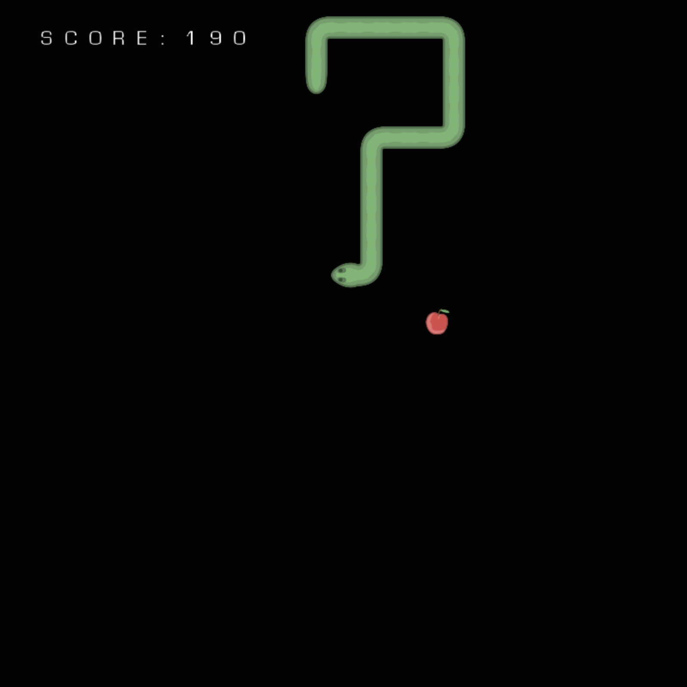

# C++ Snake Game Project & Emscripten For WASM



## TODO setup guide

> Advisement Note: this codebase was setup for Mac M1/M2 (silicon)

this project requires the following dependancys

- glew
- freeglut
- xquartz (if on macOS)
- rosetta (if on mac silicon)

> you can find these using homebrew on mac

once you have all these installed you will need to update the `c_cpp_properties.json` file with the relevant dependancy include paths as seen here:

``` json
"includePath": [
  "/usr/local/include",
  "/usr/local/Cellar/freeglut/3.6.0/include/GL",
  "/usr/local/Cellar/glew/2.2.0_1/include/GL",
  "/usr/local/Cellar/emscripten/main/system/include"
],
```

once this is updated with the relevant paths based on your system then you can move on to the next step

## TODO Getting Started & Building Guide

### VSCode

Quick ways to start building the project is `F5`
Quick way to stop debuging and close the game is `Shift + F5`

### Terminal

if you just want to use the shell all you have ti do is run `make` from the root directory
